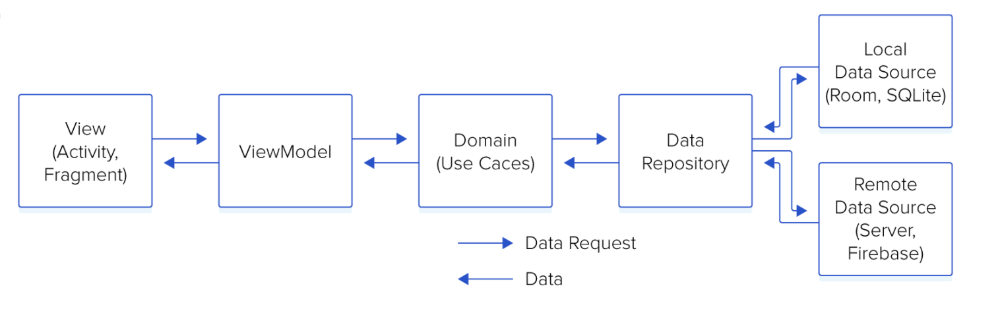
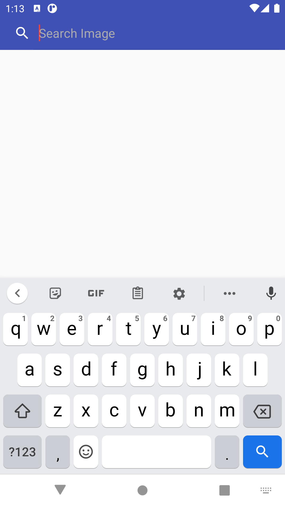
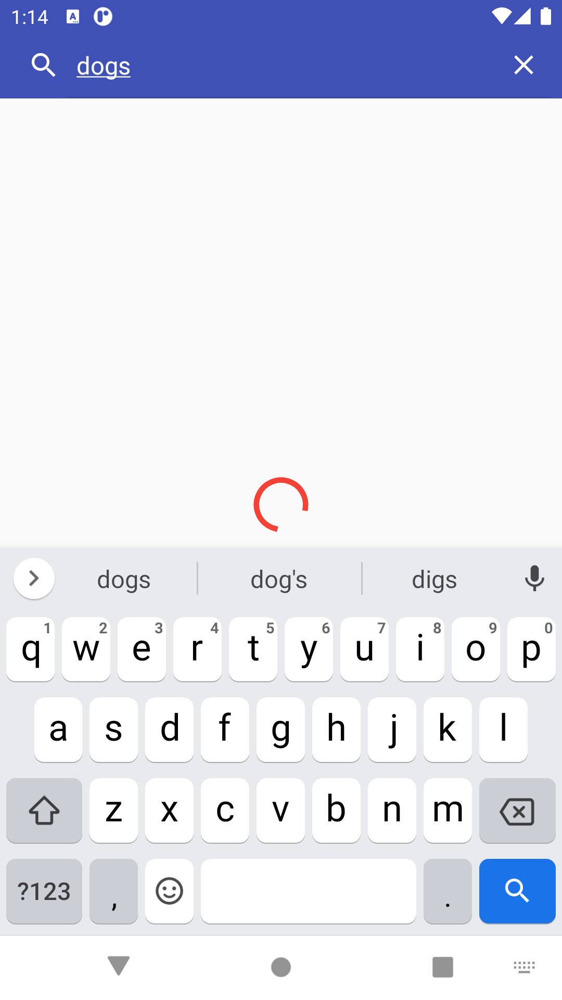
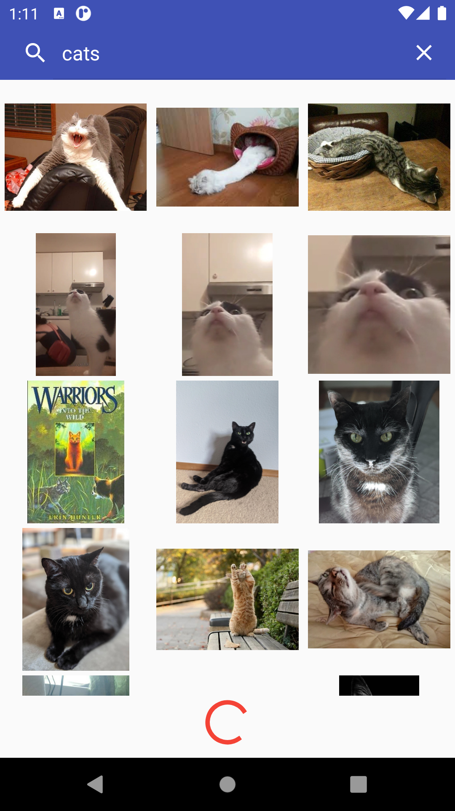
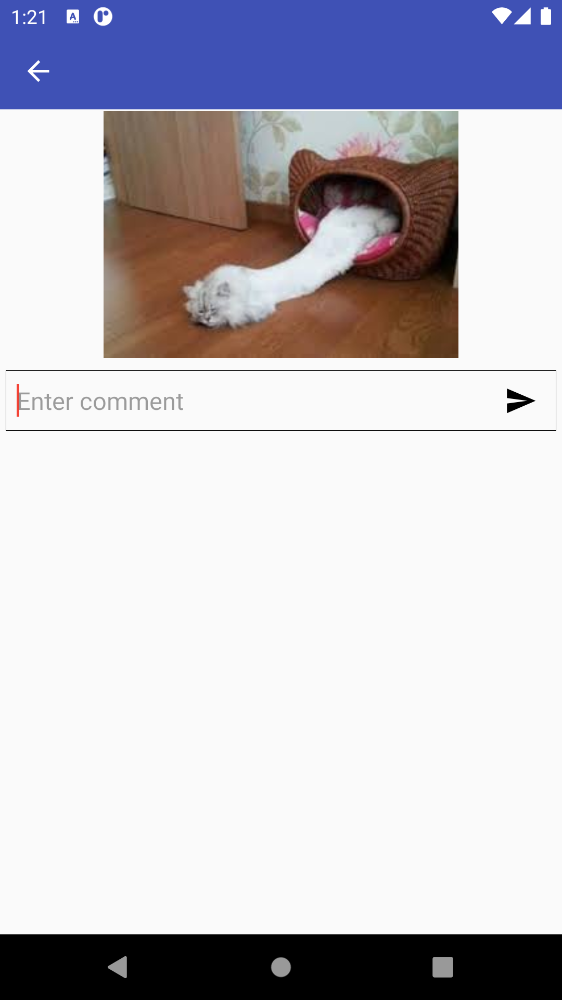
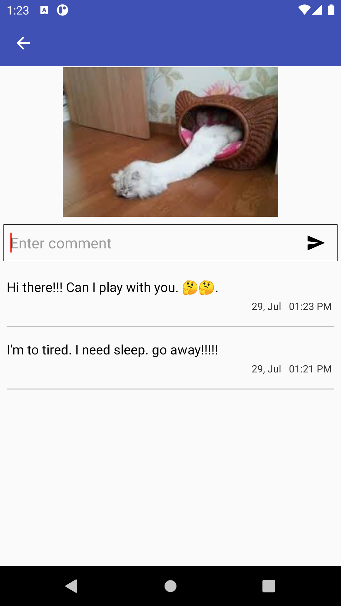

## App Architecture

This sample app used MVVM with Clean architecture

**Here app have separate domain, data and ui modules.**

1. **Domain** - It contains use-cases and repositories declarations.
2. **Data** - It contains repository implementation. Repository can fetch data from network or local data base.
3. **UI** - Here we have two sections, first ***ViewModel*** responsible to call usecase and handle logic for ui. ***View(Activity/Fragment)*** responsible for showing ui on screen.

**Data flow steps:**

1. UI ask view model to get/post required data
2. ViewModel calls respective usecase for feature
3. Usecase calls repository 
4. Repository fetch data from network/local database and pass back to usecase
5. Usecase pass back the result from repository to viewmodel
6. ViewModel do specific action on data and pass data to UI using LiveData/ Data-binding

## Technology/Component Used
1. **[Kotlin Language](https://kotlinlang.org/)** 
2. **[Clean Architecture](https://blog.cleancoder.com/uncle-bob/2012/08/13/the-clean-architecture.html)** 
3. **[ViewModel](https://developer.android.com/topic/libraries/architecture/viewmodel)** 
4. **[DataBinding](https://developer.android.com/topic/libraries/data-binding)** 
5. **[Coroutines](https://kotlinlang.org/docs/reference/coroutines/coroutines-guide.html)** 
6. **[Dagger2](https://dagger.dev/)** 
7. **[LiveData](https://developer.android.com/topic/libraries/architecture/livedata)** 
8. **[Junit4](https://junit.org/junit4/index.html)**
9. **[Room](https://developer.android.com/topic/libraries/architecture/room)**
10. **[Retrofit](https://square.github.io/retrofit/)**
11. **[Coil](https://github.com/coil-kt/coil)**

## Modules/Screens

### 1. Search image
We can search any image on `imgur`. Search images are shown in gridlayout. 
we can load image infinitely by scrolling grid of images.
Images are search using network with `imgur` search api.

|Initial | Search query | Load more |
|------------ | ------------- | ---------- |
|||

----

### 2. Image Detail
This shows detail view of image. Top section shows image below that it shows post comment section.
At the bottom we have comment section for respective image.
The comments for image is fetched from local database(Room).
Comments posted on images are stored in local database(Room)

|Initial | Search query |
|------------ | ------------- |
|||

